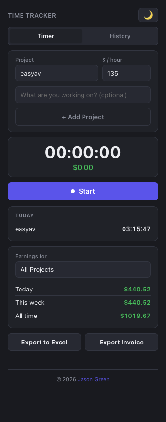
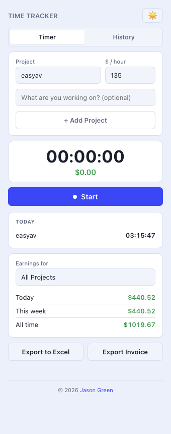
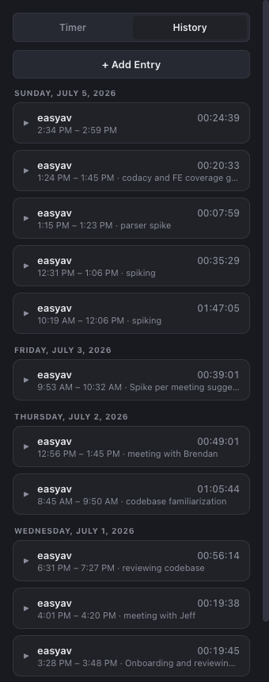
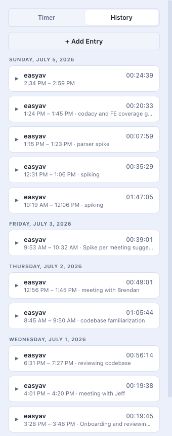
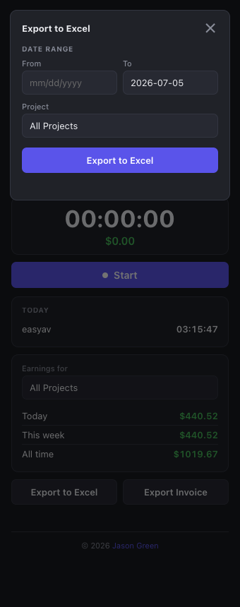
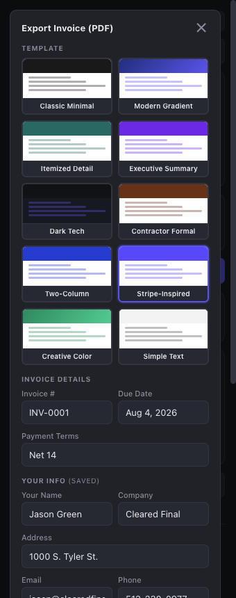
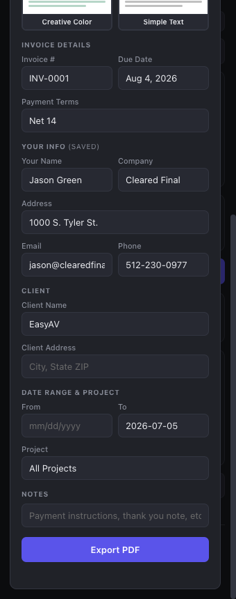

# Time Tracker

A Mac menu bar app for tracking time when developing software — built for people working independently or who just need a lightweight way to track time.

## Screenshots

| Dark | Light |
| --- | --- |
|  |  |
|  |  |

### Export to Excel



### Export Invoice (PDF)

| Template picker | Form & client details |
| --- | --- |
|  |  |

*Shown with sample data for illustration.*

## Features

- Lives in the Mac menu bar — start and stop a timer without leaving your editor
- Organize time by project, with project names auto-derived from a git repo's remote URL
- Optional note per time entry, editable while the timer is running
- Local SQLite storage — your data stays on your machine
- Per-project hourly rate, locked into each entry at start time so changing a project's rate never rewrites past earnings
- Live earnings totals for today, this week, and all time — filterable by project or across all projects
- "Today" summary of time tracked per project
- Light and dark themes with a one-click toggle (choice is remembered)
- "Edit Past Entries" view, grouped by date with collapsible rows and pagination ("Load More"), supporting full CRUD: manually add a backfilled entry, expand any entry to edit its rate or start/stop time, or delete it (two-click confirm)
- **Export to Excel** — choose a date range with a flatpickr date picker, filter by project; the last exported range is remembered so you never accidentally re-export
- **Export Invoice (PDF)** — 10 built-in HTML invoice templates; fill in your info, client details, date range, and notes, then export a polished PDF. All form fields (your info, last client, due date, payment terms, template choice) are auto-saved to the database and pre-filled the next time you open the modal
- Single-instance lock — launching the app while it's already running won't create a duplicate

## Tech stack

- [Electron](https://www.electronjs.org/) + TypeScript
- [menubar](https://github.com/maxogden/menubar) for the tray UI
- [better-sqlite3](https://github.com/WiseLibs/better-sqlite3) for local storage
- [exceljs](https://github.com/exceljs/exceljs) for Excel export
- [flatpickr](https://flatpickr.js.org/) for date pickers

## Getting started

```bash
npm install
npm run dev
```

This compiles the TypeScript and launches the app via Electron.

## Building a standalone app

```bash
npm run dist
```

This packages a standalone `Time Tracker.app` (and a `.dmg` installer) into the `release/` folder. Since the app isn't notarized with an Apple Developer ID, the first launch will require right-click → **Open** to bypass Gatekeeper's "unidentified developer" warning.

## Running tests

```bash
npm test
```

The test suite covers the database layer, invoice template rendering, and invoice utility helpers. Jest automatically rebuilds the `better-sqlite3` native module for the Node.js test environment before running, and restores the Electron build afterward.

## Usage

1. Click the tray icon and choose **+ Add Project** to point at a project's git repo folder
2. Set an hourly rate for the project (optional) and add a note describing what you're working on
3. Click **Start** to begin tracking, **Stop** to end the session
4. Click **Edit Past Entries** to browse entries by date, add a manual entry, expand a row to edit it, or delete it
5. Click **Export to Excel** to choose a date range and save tracked time to a spreadsheet
6. Click **Export Invoice** to generate a PDF invoice from one of 10 built-in templates
7. To quit the app, right-click the tray icon and choose **Quit Time Tracker**

## Author

Jason Green — jason@clearedfinal.com
